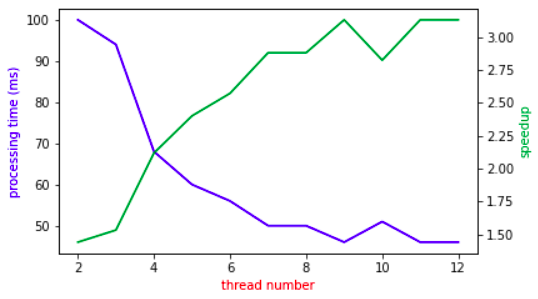
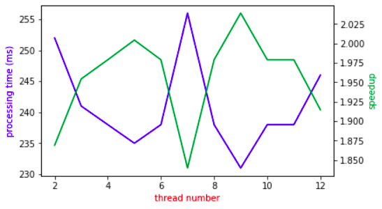
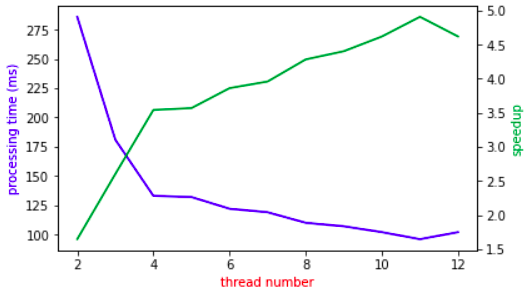
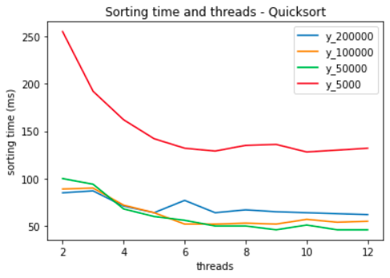
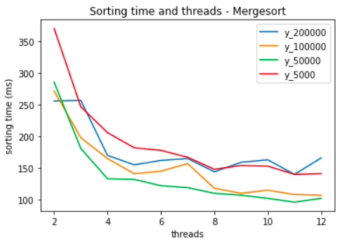

# Parallel Programming Exercise 3 Parallel Sorting

### Student 1: Thomas Bründl

### Student 2: Thomas Stummer

 

# Approach

We measured the required time to order 500000 randomly generated numbers via Quicksort and Mergesort.  
We implemented the quick and mergesort in three different variations:

1. serial version,
2. a parallel version
3. a parallel version with threshold.  

To distribute the work, we used the <i>#pragma omp task</i> because for us it seemed the most straight forward way to execute tree structured recursions in parallel. The parallel approach was tested with 1 to 12 logical cpu cores.

# Results

## Sequential QuickSort

The serial-quicksort version was performed with 500000 random numbers and took 144 ms to order all numbers.

## Parallel QuickSort

The parallel quicksort without a threshold performs poorly. It takes 303122 ms to sort the 500000 numbers on 12 threads. This is a demonstrative example for the phenomenon of oversubscription. The cost to create and manage new tasks far outweighs the benefit, the parallel execution provides.

## Parallel QuickSort with threshold

The following graph shows the required ms to sort via parallel quicksort with threshold. It also shows the speedup in relation to the sequential sorting time (144ms). This method performs better than the previous due to efficient thread usage.

## Sequential Mergesort

The serial-mergesort was also performed with 500000 random numbers and took 471 ms to order all numbers.

## Parallel Mergesort

The following graph shows the result of the parallel mergesort (without threshold). We can see that multithreading does not have a positive effect on the calculation time. As mentioned when discussing the results for the Quicksort implementation, task oversubscription is likely to lead to this arbitrary results.

## Parallel Mergesort with threshold

The following graph shows the calcuation time and the speedup in relation to the sequential mergesort time (471ms).

## Parallel QuickSort - Threshold Comparison

It can be seen, that the parallel quicksort operates better with 2 threads with a threshold of 200000 than with 50000.
However, when the thread number is increased we can see that the parallel quicksort operates better with a threshold of 50000.

## Parallel MergeSort - Threshold Comparison

It can be seen, that a threshold of around 50000 seems to be the fastest option when it comes to parallel mergesort with multithreading.

